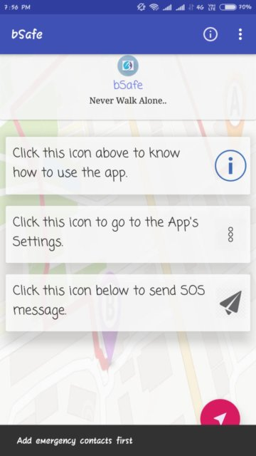
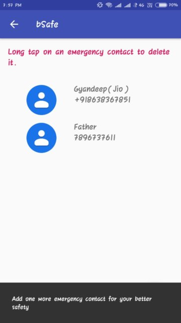
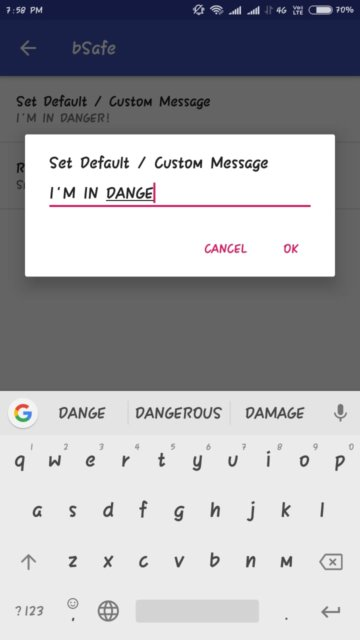

# ResQMe

This Java-based SOS emergency app allows users to send an SOS message with location to selected contacts in danger. It benefits women and children at risk of violence or abuse. It features a custom message option, GPS integration, and automated notification to emergency contacts. Overall, it mitigates harm in emergencies.

### Some snapshots of the App
|  |  |  
| ----------- | ----------- |  
|  |  |
|  |  |
||
